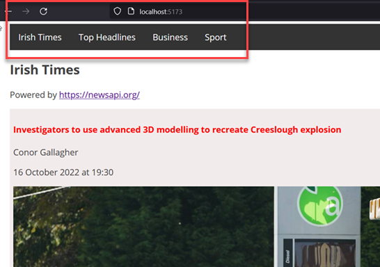
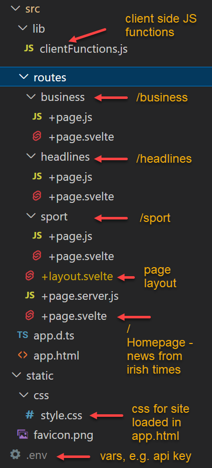

# Building a newsapi.org client with SvelteKit

Enda Lee 2022

### Quick Start

1. Download the code from this repository
2. Open in VS Code
3. Rename```.env.example``` to ```.env```, then edit with your newsapi.org api key
3. In a terminal run `npm install`
4. Start the application using `npm run dev`


## Introduction

This example rebuilds the News API app, covered in a previous lab, using SvelteKit.  Hopefully it will demonstrate some of the advantages of using the framework over plain JavaScript.

The home page of the site will display the latest news from **The Irish Times** and the other links will show news from Ireland including **Top Headlines**, **Business**, and **Sport**.




## 1. Getting started

You should start by creating a new **SvelteKit** application by running ```npm create svelte@latest```. See the [previous lab](https://github.com/elee-tudublin/2022.SSWD.5.2.sveltekit_intro#readme) for more details.

Here is the complete site structure, add all the routes, pages, and other files shown here to your new app. The files can be left empty for now.




## 2. The default route/ home page.

This page will display the top headlines from the Irish Times. As before, an api key is required from  http://newapi.org. 

### 1. Add an environment variable named **```VITE_NEWS_API_KEY ```** to the **```.env```** file. 

The variable name is important. SvelteKit makes variables with names starting with **```VITE_```** available on the SvelteKit server and also in the browser - this will be important later.

 


### 2. Generating Home Page content

When the page is loaded, news articles will be fetched from newsapi.org and used to build the content. The default page  **```src\routes\+page.svelte```** should already exist. We also need to add a companion **```+page.server.js```** script to the the same location. This purpose of this script is to fetch news articles for the page in a ```load()``` function. 

SvelteKit can run run scripts server-side (for pre rendering pages) as well as in the browser. Including **.server.** in the file name ensures that it will not execute in the browser, for example to keep an api key private.

Here is the code for **```+page.server.js```** 

```javascript
// add dependency using npm install dotenv first
import 'dotenv/config'

// The load function executes before the page is displayed
export const load = async () => {


    // This async function will fetch and return articles from the Irish Times
    const fetchNews = async () => {
        
        const source = 'the-irish-times';
        const api_key = process.env.VITE_NEWS_API_KEY

        const response = await fetch(`https://newsapi.org/v2/top-headlines?sources=${source}&apiKey=${api_key}`);
        const data = await response.json();
        console.log(data);
        return data.articles;

    }

    // Return articles - which calls fetchNews()
    return {
        articles: fetchNews(),
    }
}
```

The **load()** function will execute before the page is displayed, making its data available. The data can then be accessed in **```+page.svelte```** for display (source code below).

1. The **<script>** block imports dependencies and also reads data from **load()** and assigns it to **```articles```**.
2. The **```{#each articles as article} ... {/each}```** block iterates through the **articles** array and add them to the page. Compare this to the method used previously.

```html
<script>
    // import the formateDate function defined in clientFunctions.js
    import { formatDate } from '$lib/clientFunctions.js';
    
    // This allows access to the data exported from +page.server.js 
    export let data;
	const { articles } = data;    

</script>

<h2>Irish Times</h2>
<div id="stories" />
<p>
    Powered by <a href="https://newsapi.org/">https://newsapi.org/</a>
</p>
<div id="articles">
    <!-- a Svelete for each to iterate through articles -->
    {#each articles as article }
    <article>
        <h4>{article.title}</h4>
        <p>{article.author}</p>
        <!-- format the date using function -->
        <p>{formatDate(article.publishedAt)}</p>
        
        <p>{article.description}</p>
        <p><a href='{article.url}'>Read More</a></p>
      </article>
{/each}
</div>

```


## 3. The other pages

The other pages work in a similarly, using a **```load()```** function to generate content. For example, here is  **```+page.js```** for the  **```/business```** route. Note that this load works on both server and client sides allowing content to be pre rendered before sending to the browser as well as updates in browser.

```javascript
// The load function executes before the page is displayed
export const load = async () => {


    const fetchNews = async () => {

        const api_key = import.meta.env.VITE_NEWS_API_KEY;
        const response = await fetch(`https://newsapi.org/v2/top-headlines?country=ie&category=business&apiKey=${api_key}`);
        const data = await response.json();
        console.log(data);
        return data.articles;

    }

    return {
        articles: fetchNews(),
    }
}
```

 

The only difference in **```/business```** and **```/sport```** is the **```category=```** parameter in the fetch URL.


### 3.1 Layout and Navigation.

As in the previous lab,  **```+layout.svelte```** defines a common page layout and navigation for the app. Note that the included CSS is applied to the navigation only.

```html
<nav>
    <!-- Navigation menu with news sections - see CSS for layout-->
  <!-- Each has a data-source attribute which contains the URI to be requested-->
  <ul id="newsLinks" class="topnav">
    <li><a id="Headlines" href="/" data-sveltekit-prefetch>Irish Times</a></li>
    <li><a id="Headlines" href="/headlines" data-sveltekit-prefetch>Top Headlines</a></li>
    <li><a id="Business" href="/business" data-sveltekit-prefetch>Business</a></li>
    <li><a id="Sport" href="/sport" data-sveltekit-prefetch>Sport</a></li>
  </ul>
</nav>

<slot />

<style>
    /*
    /* https://www.w3schools.com/Css/tryit.asp?filename=trycss_navbar_horizontal_responsive
    */
    ul.topnav {
      list-style-type: none;
      margin: 0;
      padding: 0;
      overflow: hidden;
      background-color: #333;
    }
  
    ul.topnav li {
      float: left;
    }
  
    ul.topnav li a {
      display: block;
      color: white;
      text-align: center;
      padding: 14px 16px;
      text-decoration: none;
    }
  
    ul.topnav li a:hover:not(.active) {
      background-color: #111;
    }
  
    ul.topnav li a.active {
      background-color: #04AA6D;
    }
  
    ul.topnav li.right {
      float: right;
    }
  
    @media screen and (max-width: 600px) {
  
      ul.topnav li.right,
      ul.topnav li {
        float: none;
      }
    }
  </style>
```


### 3.2 Other shared content

The remaining CSS is located in **```static\css\style.css```** and linked in **```app.html```** 

Note the use of the  **```%sveltekit.assets%```** variable to access the location:

from  **```app.html```** :

```html
<!DOCTYPE html>
<html lang="en">

<head>
  <meta charset="utf-8" />
  <link rel="icon" href="%sveltekit.assets%/favicon.png" />
  <meta name="viewport" content="width=device-width" />
  %sveltekit.head%
</head>

<body>
  <div>%sveltekit.body%</div>
  <link rel="stylesheet" href="%sveltekit.assets%/css/style.css">
</body>

</html>
```


## Conclusion

Try to build the complete solution, using the finished code as a reference if you get stuck. Hopefully you will start to see some of the advanges of using a framework like SvelteKit.
